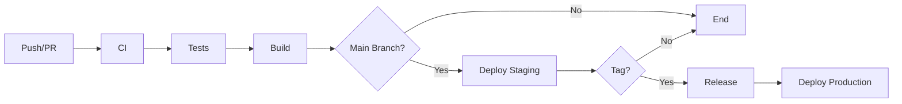

# CI/CD Documentation

Этот документ описывает все CI/CD пайплайны проекта, их назначение и настройку.

## 📋 Содержание

- [Обзор](#обзор)
- [Workflows](#workflows)
  - [CI - Continuous Integration](#ci---continuous-integration)
  - [PR - Pull Request Checks](#pr---pull-request-checks)
  - [CD - Continuous Deployment](#cd---continuous-deployment)
  - [Release - Автоматизация релизов](#release---автоматизация-релизов)
  - [Docker - Build & Push](#docker---build--push)
  - [Dependency Review](#dependency-review)
  - [CodeQL Security Analysis](#codeql-security-analysis)
  - [Performance Testing](#performance-testing)
- [Секреты и переменные](#секреты-и-переменные)
- [Настройка окружений](#настройка-окружений)
- [Best Practices](#best-practices)

## Обзор

Проект использует GitHub Actions для автоматизации всех этапов разработки:



## Workflows

### CI - Continuous Integration

**Файл:** `.github/workflows/ci.yml`

**Триггеры:**
- Push в `main`
- Pull Request в `main`

**Задачи:**

1. **Lint** - Проверка качества кода
   ```bash
   ruff check .
   ruff format --check .
   ```

2. **Test** - Запуск тестов
   ```bash
   pytest tests/ -v --tb=short
   pytest tests/ --cov=src --cov-report=xml
   ```

**Артефакты:**
- `coverage.xml` - отчет о покрытии кода

**Матрица тестирования:**
- Python 3.13

---

### PR - Pull Request Checks

**Файл:** `.github/workflows/pr.yml`

**Триггеры:**
- Pull Request в `main` или `develop`
- Типы: `opened`, `synchronize`, `reopened`

**Задачи:**

1. **Validate** - Валидация PR
   - Проверка заголовка (Conventional Commits)
   - Допустимые типы: `feat`, `fix`, `docs`, `style`, `refactor`, `perf`, `test`, `build`, `ci`, `chore`, `revert`

2. **Code Quality** - Проверки качества
   - Ruff linter
   - Ruff formatter
   - Pre-commit hooks на измененных файлах

3. **Test Suite** - Тестирование
   - Полный набор тестов
   - Генерация coverage
   - Проверка минимального порога покрытия

4. **Security** - Безопасность
   - Ruff security checks (правила S)

5. **Summary** - Итоговый статус
   - Проверка всех jobs
   - Fail если хотя бы один job не прошел

**Пример заголовка PR:**
```
feat: add user authentication
fix: resolve database connection timeout
docs: update API documentation
```

---

### CD - Continuous Deployment

**Файл:** `.github/workflows/cd.yml`

**Триггеры:**
- Push в `main`
- Push тега `v*.*.*`
- Manual workflow dispatch

**Задачи:**

1. **Build** - Сборка Docker образа
   - Multi-platform: `linux/amd64`, `linux/arm64`
   - Публикация в GitHub Container Registry
   - Кэширование слоев

2. **Deploy Staging** - Деплой на staging
   - Условие: `main` branch или manual input
   - Environment: `staging`
   - Smoke tests
   - Health check

3. **Deploy Production** - Деплой на production
   - Условие: тег `v*.*.*` или manual input
   - Environment: `production`
   - Требует approval
   - Smoke tests
   - Health check

4. **Rollback** - Откат при ошибке
   - Автоматический запуск при failure
   - Восстановление предыдущей версии

**Настройка деплоя:**

Замените placeholder команды в workflow на реальные:

```yaml
# Пример для Kubernetes
- name: Deploy to staging
  run: |
    kubectl set image deployment/app app=${{ needs.build.outputs.image-tag }}
    kubectl rollout status deployment/app

# Пример для Docker Compose на удаленном сервере
- name: Deploy to staging
  run: |
    ssh user@staging-server "
      docker pull ${{ needs.build.outputs.image-tag }}
      cd /app
      docker-compose up -d
    "
```

---

### Release - Автоматизация релизов

**Файл:** `.github/workflows/release.yml`

**Триггеры:**
- Push тега `v*.*.*`
- Manual workflow dispatch с указанием версии

**Задачи:**

1. **Validate** - Валидация релиза
   - Проверка формата версии
   - Определение типа (stable/prerelease)
   - Формат: `v1.2.3` или `v1.2.3-beta.1`

2. **Test** - Полное тестирование
   - Linting
   - Formatting
   - Tests с coverage

3. **Build Artifacts** - Сборка пакетов
   - Python wheel
   - Source distribution

4. **Generate Changelog** - Генерация changelog
   - Автоматический парсинг коммитов
   - Категоризация изменений:
     - ✨ Features (`feat:`)
     - 🐛 Bug Fixes (`fix:`)
     - 📚 Documentation (`docs:`)
     - 🔧 Other Changes

5. **Create Release** - Создание GitHub Release
   - Публикация с changelog
   - Прикрепление артефактов
   - Draft для prerelease

6. **Publish PyPI** - Публикация в PyPI
   - Только для stable releases
   - Требует `PYPI_API_TOKEN`

**Создание релиза:**

```bash
# Создать тег
git tag -a v1.0.0 -m "Release version 1.0.0"
git push origin v1.0.0

# Или prerelease
git tag -a v1.0.0-beta.1 -m "Beta release 1.0.0"
git push origin v1.0.0-beta.1
```

---

### Docker - Build & Push

**Файл:** `.github/workflows/docker.yml`

**Триггеры:**
- Push в `main` или `develop`
- Pull Request в `main`
- Push тега `v*.*.*`
- Manual workflow dispatch

**Задачи:**

1. **Docker Lint** - Проверка Dockerfile
   - Hadolint для статического анализа
   - Failure threshold: warning

2. **Build & Test** - Сборка и тестирование
   - Multi-platform build
   - Запуск контейнера и smoke tests
   - Trivy сканирование уязвимостей
   - Upload SARIF в GitHub Security

3. **Push** - Публикация образов
   - Только для non-PR событий
   - Автоматическая генерация тегов:
     - `latest` для main
     - `develop` для develop
     - `v1.2.3` для тегов
     - SHA tags
   - Build provenance attestation

**Использование образов:**

```bash
# Pull latest
docker pull ghcr.io/username/python-web-template:latest

# Pull specific version
docker pull ghcr.io/username/python-web-template:v1.0.0

# Pull develop
docker pull ghcr.io/username/python-web-template:develop
```

---

### Dependency Review

**Файл:** `.github/workflows/dependency-review.yml`

**Триггеры:**
- Pull Request в `main` или `develop`
- Schedule: каждый понедельник в 09:00 UTC
- Manual workflow dispatch

**Задачи:**

1. **Dependency Review** (только PR)
   - Анализ изменений зависимостей
   - Fail on severity: moderate
   - Запрещенные лицензии: GPL-3.0, AGPL-3.0
   - Комментарий в PR с результатами

2. **Vulnerability Scan**
   - Safety check для production deps
   - Safety check для dev deps
   - JSON и text отчеты

3. **License Check**
   - pip-licenses для генерации отчета
   - Проверка на запрещенные лицензии
   - Markdown и JSON форматы

4. **Outdated Check**
   - Поиск устаревших пакетов
   - Отчет с рекомендациями

5. **Create Issue** (при scheduled scan failure)
   - Автоматическое создание issue
   - Labels: `security`, `dependencies`, `automated`
   - Не создает дубликаты

**Артефакты:**
- `safety-scan-results` - результаты сканирования
- `license-report` - отчет о лицензиях
- `outdated-report` - устаревшие пакеты

---

### CodeQL Security Analysis

**Файл:** `.github/workflows/codeql.yml`

**Триггеры:**
- Push в `main` или `develop`
- Pull Request в `main` или `develop`
- Schedule: ежедневно в 06:00 UTC
- Manual workflow dispatch

**Задачи:**

1. **Analyze** - Статический анализ
   - Language: Python
   - Queries: security-and-quality
   - Исключения: tests, .venv
   - Upload в GitHub Security

2. **Filter SARIF** (для PR)
   - Фильтрация результатов для измененных файлов
   - Исключение тестов из результатов

**Настройка:**

Результаты доступны в:
- Security tab → Code scanning alerts
- Pull Request checks

**Игнорирование false positives:**

Добавьте комментарий в код:
```python
# codeql[py/sql-injection]
query = f"SELECT * FROM users WHERE id = {user_id}"
```

---

### Performance Testing

**Файл:** `.github/workflows/performance.yml`

**Триггеры:**
- Pull Request в `main` или `develop`
- Push в `main`
- Schedule: каждое воскресенье в 03:00 UTC
- Manual workflow dispatch с параметрами

**Задачи:**

1. **Load Testing** - Нагрузочное тестирование
   - Инструмент: Locust
   - Настраиваемое количество пользователей
   - Настраиваемая длительность
   - HTML отчет и CSV статистика

2. **Benchmark** - Python бенчмарки
   - pytest-benchmark
   - JSON результаты
   - Гистограммы
   - Сравнение с baseline (main branch)

3. **Memory Profiling** - Профилирование памяти
   - pytest-memray
   - Топ-10 самых ресурсоемких операций

4. **API Performance** - Тесты API
   - Инструмент: k6
   - Staged load testing
   - Thresholds для p95 latency
   - JSON результаты

5. **Summary** - Сводка результатов
   - Таблица всех тестов
   - Комментарий в PR
   - Ссылки на артефакты

**Manual запуск с параметрами:**

```yaml
duration: '300'  # 5 минут
users: '500'     # 500 одновременных пользователей
```

**Создание custom тестов:**

```python
# tests/benchmarks/test_my_benchmark.py
def test_my_function_performance(benchmark):
    result = benchmark(my_function, arg1, arg2)
    assert result is not None

# locustfile.py
from locust import HttpUser, task, between

class MyUser(HttpUser):
    wait_time = between(1, 3)
    
    @task
    def my_endpoint(self):
        self.client.get("/api/endpoint")

# k6-script.js
import http from 'k6/http';
export default function () {
    http.get('http://localhost:8000/api/endpoint');
}
```

---

## Секреты и переменные

### Обязательные секреты

Настройте в Settings → Secrets and variables → Actions:

1. **GITHUB_TOKEN** (автоматически доступен)
   - Используется для GitHub API
   - Permissions настраиваются в workflow

2. **PYPI_API_TOKEN** (опционально)
   - Для публикации в PyPI
   - Получить на https://pypi.org/manage/account/token/

### Рекомендуемые секреты для деплоя

3. **DEPLOY_SSH_KEY**
   - SSH ключ для деплоя на сервер
   ```bash
   ssh-keygen -t ed25519 -C "github-actions"
   ```

4. **KUBE_CONFIG**
   - Kubernetes config для kubectl
   - Base64 encoded

5. **SLACK_WEBHOOK_URL** / **DISCORD_WEBHOOK_URL**
   - Для уведомлений о деплое

### Переменные окружения

Настройте в Settings → Environments:

**Staging:**
- `ENVIRONMENT_NAME`: staging
- `DEPLOY_URL`: https://staging.example.com
- `DATABASE_URL`: (encrypted)

**Production:**
- `ENVIRONMENT_NAME`: production
- `DEPLOY_URL`: https://example.com
- `DATABASE_URL`: (encrypted)
- Требуется approval для деплоя

---

## Настройка окружений

### 1. Создание окружения

Settings → Environments → New environment

**Staging:**
- Name: `staging`
- Protection rules:
  - Required reviewers: 0
  - Wait timer: 0 minutes

**Production:**
- Name: `production`
- Protection rules:
  - Required reviewers: 1-6 (рекомендуется 2)
  - Wait timer: 5 minutes
  - Deployment branches: только tags `v*.*.*`

### 2. Настройка GitHub Container Registry

1. Создать Personal Access Token:
   - Settings → Developer settings → Personal access tokens
   - Scopes: `write:packages`, `delete:packages`

2. Логин локально:
   ```bash
   echo $GITHUB_TOKEN | docker login ghcr.io -u USERNAME --password-stdin
   ```

3. В workflow используется автоматический `GITHUB_TOKEN`

### 3. Настройка PyPI

1. Создать API token на PyPI
2. Добавить как secret `PYPI_API_TOKEN`
3. Настроить environment `pypi` с required reviewers

---

## Best Practices

### 1. Версионирование

Используйте Semantic Versioning:
- **MAJOR** (1.0.0) - breaking changes
- **MINOR** (0.1.0) - новая функциональность (backward compatible)
- **PATCH** (0.0.1) - bug fixes

Prerelease форматы:
- `v1.0.0-alpha.1` - alpha версия
- `v1.0.0-beta.1` - beta версия
- `v1.0.0-rc.1` - release candidate

### 2. Коммиты

Conventional Commits формат обязателен:
```
<type>(<scope>): <subject>

<body>

<footer>
```

Примеры:
```
feat(auth): add OAuth2 authentication
fix(db): resolve connection pool exhaustion
docs(api): update endpoint documentation
perf(query): optimize user search query
```

### 3. Pull Requests

**Чеклист перед созданием PR:**
- [ ] Все тесты проходят локально
- [ ] Код отформатирован (`ruff format`)
- [ ] Нет lint ошибок (`ruff check`)
- [ ] Добавлены тесты для новой функциональности
- [ ] Обновлена документация
- [ ] Заголовок PR следует Conventional Commits

**Процесс review:**
1. Создать PR с корректным заголовком
2. Дождаться прохождения всех checks
3. Запросить review у команды
4. Внести правки если необходимо
5. После approval - merge

### 4. Деплой

**Staging:**
- Автоматический при merge в `main`
- Можно откатить через re-run workflow

**Production:**
1. Создать и push тег:
   ```bash
   git tag -a v1.0.0 -m "Release 1.0.0"
   git push origin v1.0.0
   ```
2. Дождаться создания release
3. Approve deployment в GitHub UI
4. Мониторить метрики после деплоя

**Rollback:**
```bash
# Automatic rollback в workflow при failure
# Или manual:
kubectl rollout undo deployment/app
# или
docker-compose pull app:previous-tag && docker-compose up -d
```

### 5. Мониторинг

После деплоя проверьте:
- [ ] Health checks проходят
- [ ] Логи без errors
- [ ] Метрики в норме (response time, error rate)
- [ ] Database migrations применены
- [ ] External services доступны

### 6. Security

**Регулярные проверки:**
- Dependency scanning запускается еженедельно
- CodeQL сканирует код ежедневно
- Trivy проверяет Docker образы при каждой сборке

**При обнаружении уязвимости:**
1. Оценить severity и impact
2. Обновить зависимость
3. Запустить тесты
4. Создать hotfix release если критично

### 7. Performance

**Триггеры для performance тестов:**
- Перед каждым релизом
- При изменениях в критических путях
- Еженедельно автоматически

**Метрики для мониторинга:**
- Response time (p50, p95, p99)
- Throughput (requests/sec)
- Error rate
- Memory usage
- Database query time

---

## Troubleshooting

### Workflow не запускается

1. Проверьте triggers в workflow файле
2. Убедитесь что branch/tag соответствует условиям
3. Проверьте permissions в workflow
4. Проверьте Actions settings в репозитории

### Тесты падают в CI но работают локально

1. Проверьте environment variables
2. Убедитесь что зависимости совпадают (`uv.lock`)
3. Проверьте версию Python
4. Добавьте debug logging

### Docker build fails

1. Проверьте Dockerfile syntax
2. Запустите hadolint локально:
   ```bash
   docker run --rm -i hadolint/hadolint < Dockerfile
   ```
3. Проверьте multi-platform compatibility
4. Очистите build cache

### Deployment fails

1. Проверьте secrets и variables
2. Проверьте connectivity к target серверу
3. Проверьте health checks
4. Посмотрите логи в workflow run
5. Запустите rollback если необходимо

---

## Дополнительные ресурсы

- [GitHub Actions Documentation](https://docs.github.com/en/actions)
- [Docker Documentation](https://docs.docker.com/)
- [Conventional Commits](https://www.conventionalcommits.org/)
- [Semantic Versioning](https://semver.org/)
- [Trivy Scanner](https://aquasecurity.github.io/trivy/)
- [CodeQL Documentation](https://codeql.github.com/docs/)

---

**Последнее обновление:** 2024
**Версия документации:** 1.0.0