# CI/CD Workflows Diagram

Визуальное представление всех CI/CD пайплайнов и их взаимодействия.

## 🔄 Общий обзор процесса

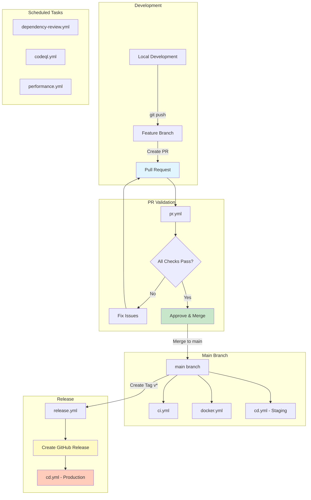

## 📋 Детальная диаграмма workflows

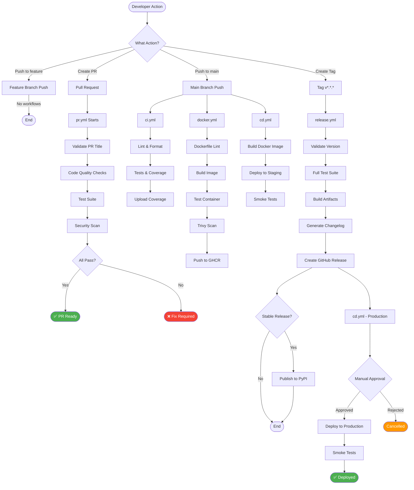

## 🕐 Scheduled Workflows

```mermaid
gantt
    title Scheduled CI/CD Jobs
    dateFormat HH:mm
    axisFormat %H:%M
    
    section Security
    CodeQL Daily Scan           :codeql, 06:00, 1h
    
    section Dependencies
    Dependency Review Weekly    :dep, 09:00, 1h
    
    section Performance
    Performance Tests Weekly    :perf, 03:00, 2h
```

## 🔀 Workflow Triggers Matrix

| Workflow | Push main | Push tag | PR | Schedule | Manual |
|----------|-----------|----------|-----|----------|--------|
| **ci.yml** | ✅ | ❌ | ✅ | ❌ | ❌ |
| **pr.yml** | ❌ | ❌ | ✅ | ❌ | ❌ |
| **cd.yml** | ✅ | ✅ | ❌ | ❌ | ✅ |
| **release.yml** | ❌ | ✅ | ❌ | ❌ | ✅ |
| **docker.yml** | ✅ | ✅ | ✅ | ❌ | ✅ |
| **dependency-review.yml** | ❌ | ❌ | ✅ | ✅ Mon 09:00 | ✅ |
| **codeql.yml** | ✅ | ❌ | ✅ | ✅ Daily 06:00 | ✅ |
| **performance.yml** | ✅ | ❌ | ✅ | ✅ Sun 03:00 | ✅ |

## 🎯 Jobs Execution Flow

### PR Workflow (pr.yml)
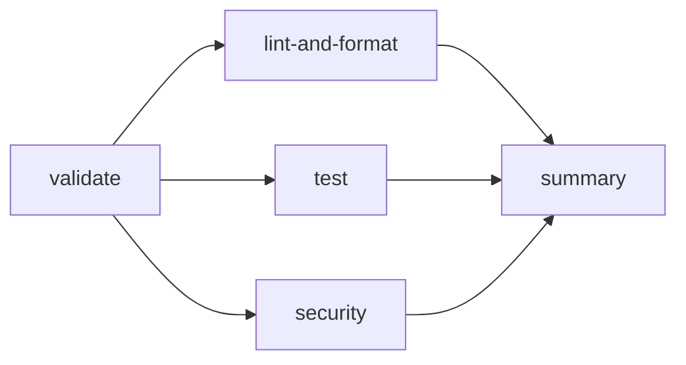

### CD Workflow (cd.yml)
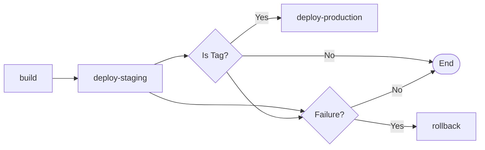

### Release Workflow (release.yml)
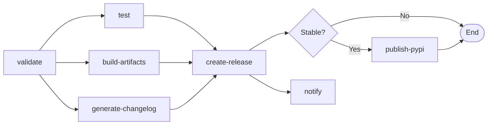

### Docker Workflow (docker.yml)
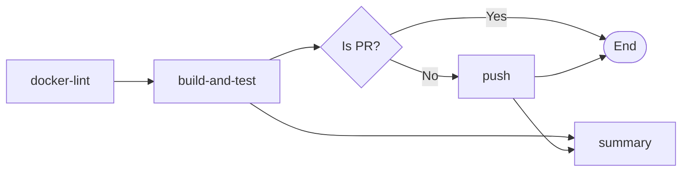

### Performance Workflow (performance.yml)
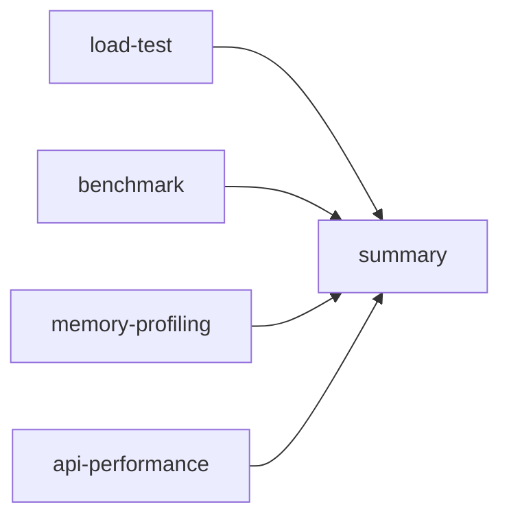

## 🔐 Security Scanning Pipeline

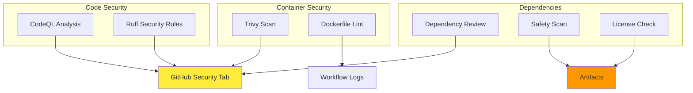

## 📦 Artifact Flow

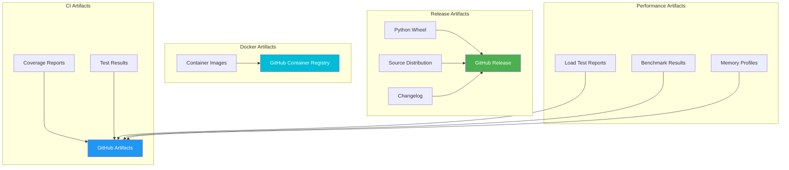

## 🚀 Deployment Pipeline

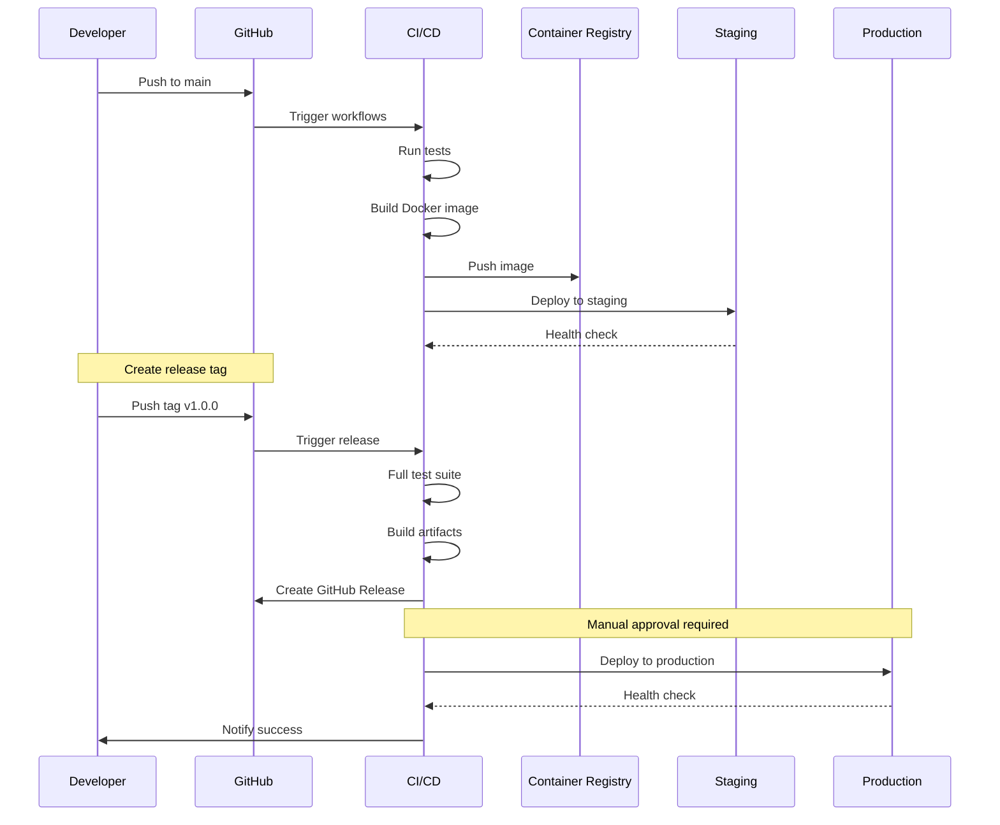

## 🔄 Rollback Strategy

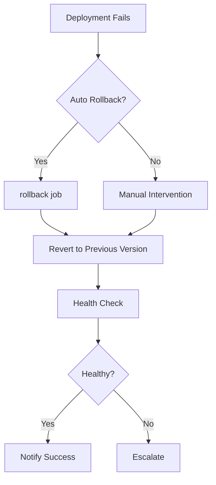

## 📊 Metrics & Monitoring

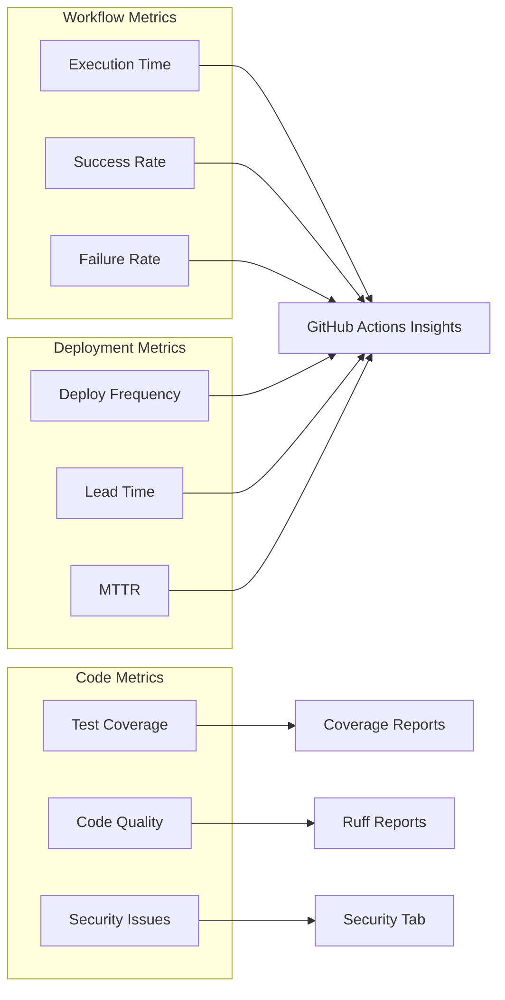

## 🎭 Environment Flow

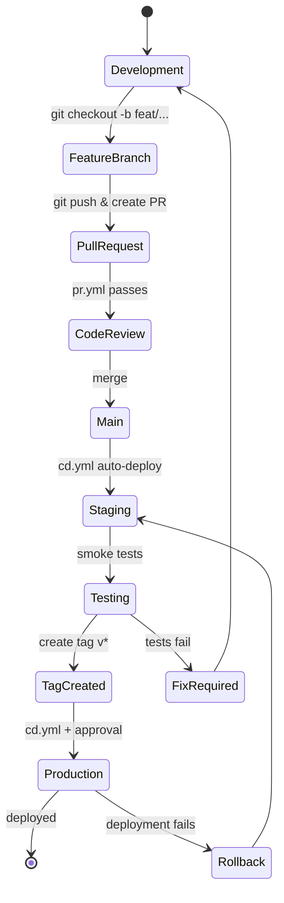

## 📝 Legend

| Symbol | Meaning |
|--------|---------|
| ✅ | Enabled/Active |
| ❌ | Disabled/Inactive |
| 🔄 | Automated process |
| 👤 | Manual approval required |
| 🔐 | Security-related |
| 📦 | Artifact generation |
| 🚀 | Deployment step |
| ⚡ | Performance-related |

---

**Last Updated:** 2024  
**Version:** 1.0.0